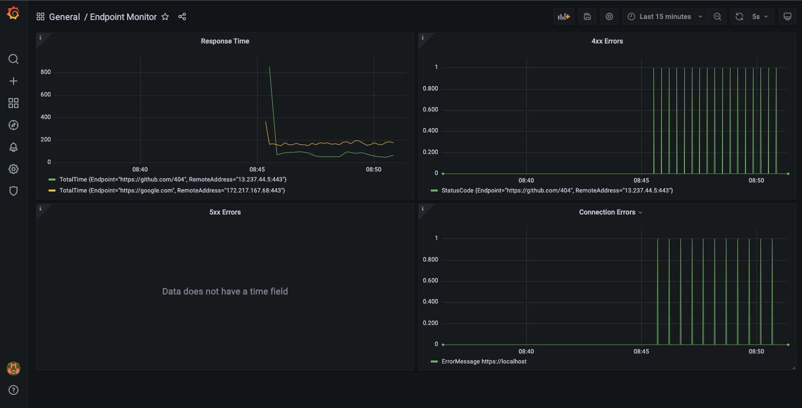

# Endpoint Monitor CLI

Endpoint monitor CLI built with Golang, InfluxDB and Grafana.

## Features

* Check the availability of websites or API endpoints.
* Monitoring metrics:
    * DNS lookup time
    * TCP connection time
    * TLS handshake time
    * Server response time
    * Response status code
* Log request/connection error

## Monitor Configure

status command takes a YAML configure file as input. example:

```yaml
# endpoint array
endpoints:
  - url: https://github.com/CameronXie/endpoint-monitor # endpoint URL
    interval: 10 # number of seconds
```

## Install

* Make sure you have docker engine 19.03+ installed.
* Simply run `make up` from the project root directory to spin up docker containers.
* Create a configure file in project root directory. For example `config.yml`.
* Run `make monitor config={your_config_file_path}` to start the monitor. For example `make monitor config=config.yml`.
* Open `http://localhost:3000/d/data/endpoint-monitor?orgId=1&refresh=5s` in your browser to check predefined dashboard.
* All credential can be found in `.env` file.

## Dashboard

The project builds a predefined dashboard (Response Time, 4xx errors, 5xx errors and connection errors) in Grafana.



## Test

* Simple run `make up` from the project root directory to spin up docker containers.
* Run `make ci-test` to start the lint and unit tests.

## Contributing
Feedback is welcome.